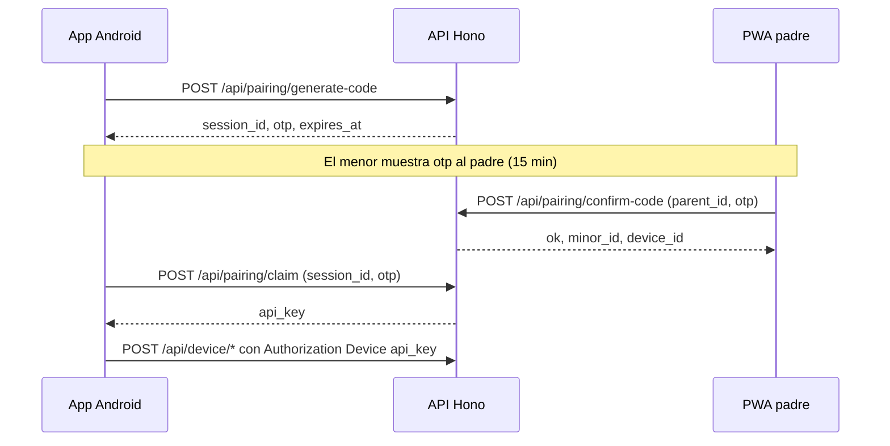

# Vinculación PWA ↔ dispositivo Android (estado del repositorio)

Este documento describe **cómo funciona hoy** el emparejamiento en el monorepo `HCKMX26-1776486277`, qué debe coincidir entre el celular y la PWA, y cómo depurar cuando “no hay conexión”.

## Regla de oro

**El móvil y la PWA deben hablar con la misma instancia de API** (misma URL base) para que compartan **la misma base de datos Supabase**.

- Si el Android llama a `http://192.168.0.15:8788/api/...` y la PWA (en el navegador) envía el código a `https://…railway.app/api/…`, el OTP **no existirá** en la segunda base: obtendrás *Código inválido o expirado* o errores de red.
- En local con `pnpm dev`, la PWA usa por defecto rutas relativas `/api` y Vite **proxifica** a `http://127.0.0.1:8788` (configurable con `VITE_API_PROXY_TARGET` / `API_PROXY_TARGET` en `apps/pwa/vite.config.ts`). El móvil en el mismo PC debe usar **`http://127.0.0.1:8788`** o la **IP LAN de tu PC + puerto 8788** (no mezclar con otra URL desplegada).

## Variables de entorno relevantes

| Ubicación | Variable | Efecto |
|-----------|----------|--------|
| Raíz del monorepo | `SUPABASE_URL`, `SUPABASE_SERVICE_ROLE_KEY` | API Hono (`apps/api`) — lectura/escritura de `pairing_sessions`, `minors`, etc. |
| Raíz del monorepo (o `.env` cargado por Vite) | `VITE_API_BASE_URL` | Base absoluta de la API para **build** de la PWA. Si no existe en dev: se usan URLs relativas + proxy. Si no existe en build de producción: cae al fallback remoto definido en código (revisar `apps/pwa/src/lib/api.ts`). |
| Raíz | `VITE_API_BASE_URL=` (vacío explícito) | Fuerza URL relativa `/api` también en build (útil con `vite preview` + proxy). |
| Raíz / entorno | `VITE_API_PROXY_TARGET` o `API_PROXY_TARGET` | Destino del proxy de Vite (`apps/pwa/vite.config.ts`), por defecto `http://127.0.0.1:8788`. |
| API | `RELAX_DEVICE_AUTH=1` | Solo depuración: omite comprobación de `Authorization: Device` en `/api/device/*`. **No usar en producción.** |

La PWA lee variables `VITE_*` desde la **raíz del monorepo** (`envDir` en `apps/pwa/vite.config.ts` apunta a `../..`), alineado con el `.env` que ya usa la API.

## Identificador de padre en modo demo (PWA)

La PWA actual no usa Supabase Auth en el cliente. El `parent_id` que envía la pantalla de vinculación es el UUID fijo definido en código:

- `apps/pwa/src/context/AuthContext.jsx` → `DEMO_PARENT_ID` = `00000000-0000-4000-8000-000000000001`

`POST /api/pairing/confirm-code` debe recibir **ese mismo** `parent_id` (lo hace la PWA automáticamente). No hace falta JWT en este prototipo para esa ruta.

## Secuencia temporal (orden obligatorio)

1. **Android** — `POST /api/pairing/generate-code` → guarda `session_id` y muestra `otp` (6 caracteres).
2. **Padre (PWA)** — `POST /api/pairing/confirm-code` con `{ parent_id, otp }` mientras la sesión siga en estado `pending` y no haya expirado.
3. **Android** — `POST /api/pairing/claim` con `{ session_id, otp }` **después** del paso 2. Si se llama antes, la API responde que aún no está confirmado por el padre.
4. **Android** — Guardar `api_key` y llamar a `/api/device/heartbeat`, `/api/device/alerts`, etc. con `Authorization: Device <api_key>` (salvo `RELAX_DEVICE_AUTH=1`).

## Formato del OTP

- Alfabeto seguro: `A-Z` y `2-9` **sin** `I`, `O`, `0`, `1` (ver `apps/api/src/pairing/otp.ts`).
- La PWA normaliza a mayúsculas. Si el usuario confunde `0` con `O`, la validación fallará.

## Comprobaciones rápidas (checklist)

1. `pnpm dev` y en logs: API escuchando en `:8788` y Vite en `:5173`.
2. Desde el PC: `curl -s http://127.0.0.1:8788/health` → `ok: true`.
3. Desde el PC: generar código como el móvil:  
   `curl -s -X POST http://127.0.0.1:8788/api/pairing/generate-code -H "Content-Type: application/json" -d "{}"`  
   Anotar `otp` y probar confirmación con el `parent_id` demo (ver arriba).
4. En la PWA, bajo el campo OTP, se muestra la etiqueta **“API PWA: …”**: debe ser coherente con la URL que usa el Android.
5. Supabase: existencia de tabla `pairing_sessions` y columnas descritas en `docs/supabase_schema.md` / migraciones del equipo.

## Documentación relacionada

- Contratos HTTP detallados: `docs/endpoints_movil.md`
- Esquema: `docs/supabase_schema.md`
- Arranque local: `docs/como_ejecutar.md`
